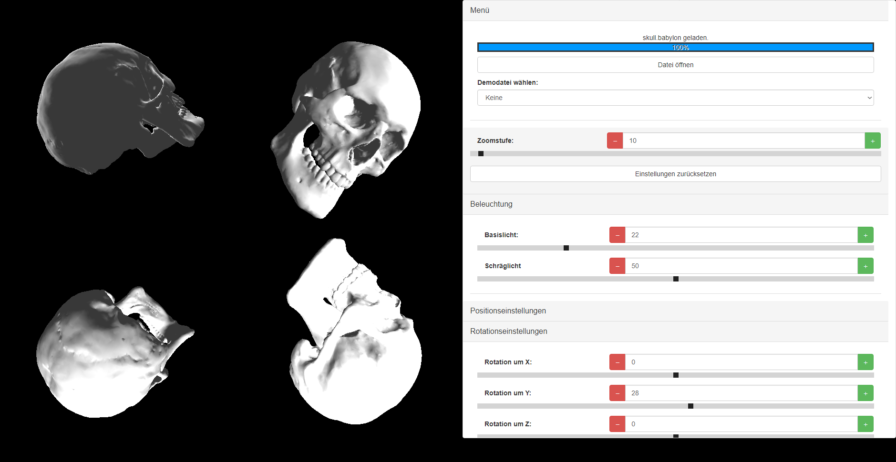

# HoloView
Mit dieser Web-App lassen sich objekte in einer sog. Hologramm-Pyramide 3-dimensional darstellen.
## Anleitung
Einfach unter *Menü* ein Objekt wählen über
* die Auswahl im Dropdown
* dem Einlesen einer eigenen Datei

angeben.
Weiter Einstellungen können dann über die verschieden Untermenüs angegeben werden.
## Screenshot

