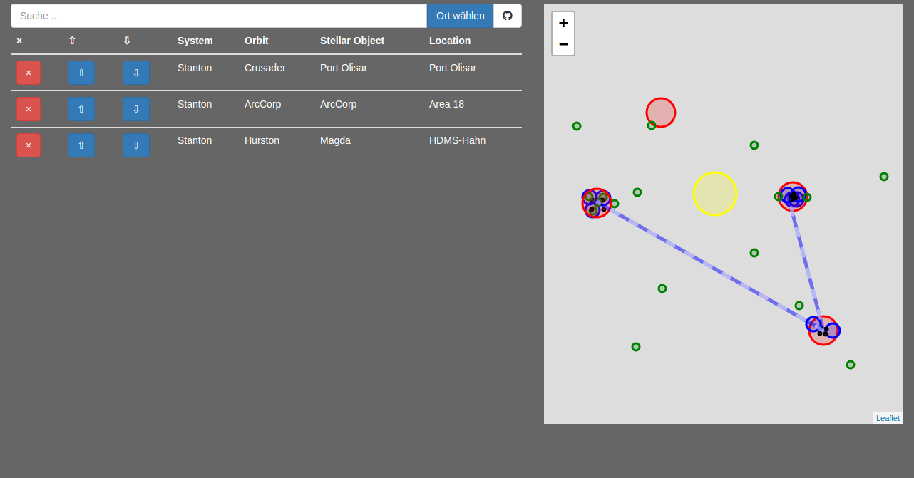

# SCRouting
Diese Web-App soll beim Ausliefern mehrerer Pakete im Vers helfen.
## Anleitung
Einfach als erstes den Startpunkt und anschließend den Zielort über
* die Eingabe im Textfeld
* die Auswahl *Ort wählen*
* die Auswahl in der Karte

angeben.
Weitere Ziele können ebenfalls angegeben werden.
Die Reihenfolge kann über die Pfeile angepasst werden.
Zum Abwählen bestimmter Orte einfach das **X** verwenden.
## Screenshot

